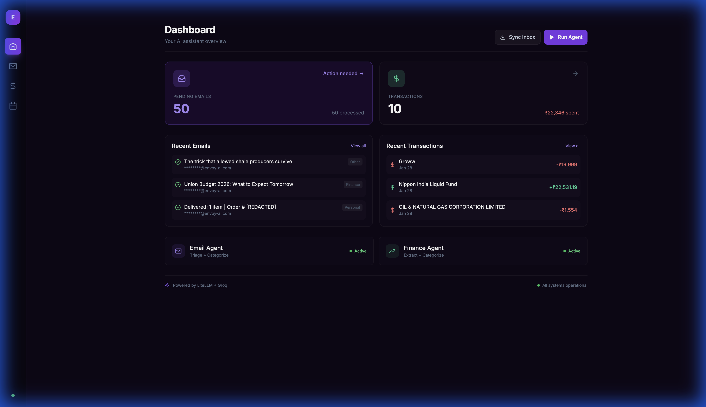
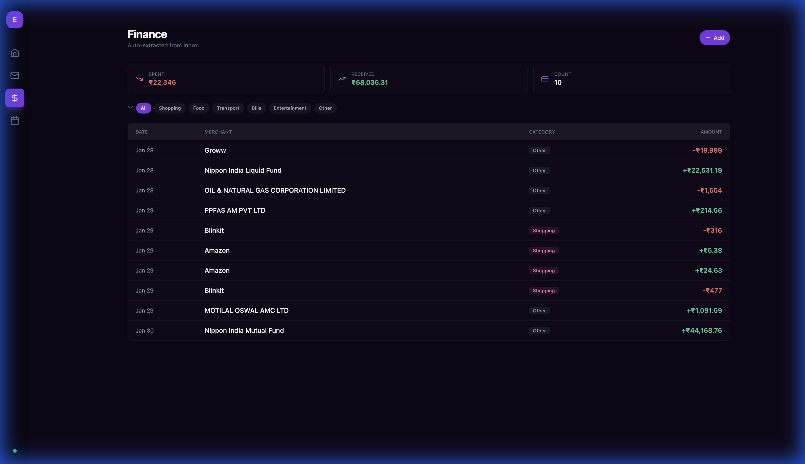

# Envoy AI - Demo

**Author:** Vinayak Shivapuje

Screenshots showcasing the Envoy AI multi-agent orchestration platform.

---

## Dashboard

The command center showing pending tasks, quick actions, and agent status.



**Features:**
- 📬 **Pending Emails** count with action indicator
- 💰 **Transactions** summary with total spent
- ⚡ **Quick Actions** (Sync Inbox, Run Agent)
- 📊 **Recent Activity** feed
- 🤖 **Agent Status** (Email Agent, Finance Agent)

---

## Email Inbox

AI-powered email triage with smart categorization.


**Features:**
- 🏷️ **Category Filters** (Pending, All, Finance, Work, Personal, Newsletter)
- 📝 **AI Summaries** for each email
- ⚡ **Urgency Scores** (1-10)
- 🎯 **Action Items** identification
- 🔄 **One-click Processing**

---

## Finance Tracker

Automatic transaction extraction from bank emails.



**Features:**
- 📊 **Stats Overview** (Spent, Received, Count)
- 📋 **Transaction Table** with categories
- 🏪 **Merchant Detection** (Groww, Amazon, Blinkit, etc.)
- 💹 **Debit/Credit Classification**
- 🔗 **Linked to Source Emails**

---

## Tech Stack

| Layer | Technology |
|-------|------------|
| **Frontend** | Next.js 14, React, TypeScript, Tailwind CSS |
| **Backend** | FastAPI, Python 3.11+, SQLAlchemy |
| **AI/LLM** | LiteLLM, Groq (Llama 3.3 70B) |
| **Email** | IMAP via imap-tools |

---

## Get Started

```bash
git clone https://github.com/Shivapuje/envoy-ai.git
cd envoy-ai
# See SETUP.md for detailed instructions
```

---

*Built by Vinayak Shivapuje*
